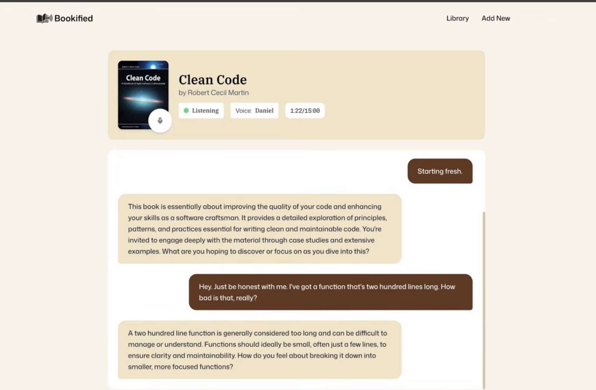

# 🤖 Vox Tome AI

<div align="center">
  
  
  
  
  
  
</div>

---

### 🌐 [Live Demo Link](https://vox-tome-ai.vercel.app/)

**Vox Tome AI** is a high-performance generative platform that transforms static PDFs into interactive **AI Voice** conversations. Designed for immersive reading, it allows users to chat with their books in real-time using a sophisticated "Voice Orchestration" workspace.

## 🖼️ Preview

<div align="center">
  
  
</div>

---

## 🚀 Key Features

* **AI Voice Architecture**: Leverages **Vapi AI** to generate natural, low-latency human-like voice conversations.
* **Intelligent PDF Parsing**: Processes large-scale documents to provide context-aware answers from any chapter.
* **Integrated Library**: A unified workspace featuring all your uploaded books, searchable instantly.
* **SaaS Subscription Suite**: Built-in tiered access (Free, Standard, Pro) for managing usage limits.
* **Secure Authentication**: Integrated with **Clerk** for robust user management and protected routes.
* **Responsive Interface**: Fully optimized for mobile, tablet, and desktop viewing.

## 💻 Tech Stack & Knowledge Used

* **Frontend Framework**: Next.js 15 (App Router)
* **Voice Engine**: Vapi AI (Real-time Orchestration)
* **Auth & Billing**: Clerk (OAuth & Subscriptions)
* **Database**: MongoDB (Mongoose)
* **Styling**: Tailwind CSS & Shadcn/UI
* **Language**: TypeScript

## 🛡️ Authorization & Security

To protect sensitive information, this project implements:
* **Environment-based Management**: API keys are managed via `.env` variables (Clerk, Vapi, MongoDB) to prevent exposure.
* **Git Protection**: A strictly configured `.gitignore` ensures that private configuration files are never pushed to public repositories.

## 🛠️ Installation

1.  **Clone the repo:**
    ```bash
    git clone [https://github.com/ishurana001/Vox-Tome-AI.git](https://github.com/ishurana001/Vox-Tome-AI.git)
    ```

2.  **Install dependencies:**
    ```bash
    npm install
    ```

3.  **Configure API Keys (.env.local):**
    ```env
    # CLERK
    NEXT_PUBLIC_CLERK_PUBLISHABLE_KEY = "YOUR_CLERK_PUBLISHABLE_KEY"
    CLERK_SECRET_KEY = "YOUR_CLERK_SECRET_KEY"
    NEXT_PUBLIC_CLERK_SIGN_IN_URL = /sign-in
    NEXT_PUBLIC_CLERK_SIGN_UP_URL = /sign-up
    NEXT_PUBLIC_CLERK_SIGN_IN_FALLBACK_REDIRECT_URL = /
    NEXT_PUBLIC_CLERK_SIGN_UP_FALLBACK_REDIRECT_URL = /

    # VERCEL BLOB
    BLOB_READ_WRITE_TOKEN = "YOUR_VERCEL_BLOB_TOKEN"

    # MONGODB
    MONGODB_URI = "YOUR_MONGODB_URI"

    # VAPI
    NEXT_PUBLIC_VAPI_API_KEY = "YOUR_VAPI_PUBLIC_KEY"
    VAPI_SERVER_SECRET = "YOUR_VAPI_SERVER_SECRET"
    ```

4.  **Run locally:**
    ```bash
    npm run dev
    ```
